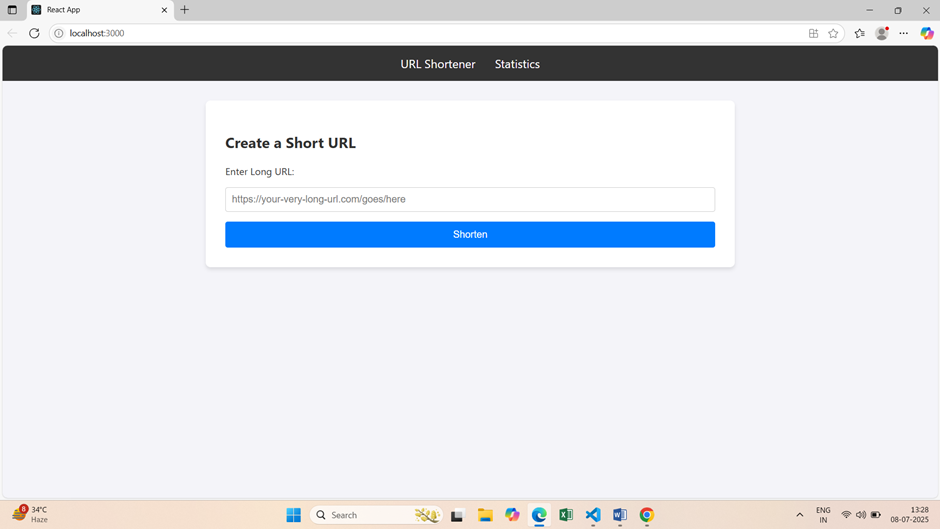

# Full-Stack URL Shortener Microservice



This is a complete URL shortener application built with a React frontend and a Node.js/Express backend. It allows users to create short, manageable links from long URLs, which redirect to the original address. The service also provides basic analytics, tracking the number of clicks for each shortened link.

This project was built to demonstrate proficiency in full-stack development, API design, and a microservice-based architecture.

---

## Key Features

-   **Shorten URLs**: Convert long, unwieldy URLs into simple, short links.
-   **Custom Shortcodes**: Users can optionally provide their own custom alias for a shortened link.
-   **Unique ID Generation**: If no custom shortcode is provided, a unique, random one is automatically generated.
-   **URL Redirection**: Accessing a short link redirects the user to the original long URL.
-   **Click Statistics**: A dedicated page to view analytics for each link, including creation/expiry dates and total click count.
-   **Link Expiration**: Shortened links automatically expire after a default period of 30 minutes (or a user-specified duration).
-   **Mandatory Logging**: All API requests are logged to a file using a custom middleware, as per project requirements.

---

## Tech Stack

-   **Frontend**:
    -   React.js
    -   Axios (for making HTTP requests)
    -   React Router (`react-router-dom`)
    -   Standard CSS for styling

-   **Backend**:
    -   Node.js
    -   Express.js
    -   MongoDB (with Mongoose for object modeling)
    -   `shortid` for unique string generation
    -   `dotenv` for environment variable management
    -   `cors` for cross-origin resource sharing

---

## Getting Started

Follow these instructions to get a copy of the project up and running on your local machine for development and testing purposes.

### Prerequisites

You must have the following software installed on your machine:
-   [Node.js](https://nodejs.org/) (v16 or newer recommended)
-   [MongoDB](https://www.mongodb.com/try/download/community) (Make sure the MongoDB server is running)

### Installation & Setup

1.  **Clone the repository:**
    ```sh
    git clone https://github.com/your-username/your-repo-name.git
    cd your-repo-name
    ```

2.  **Setup the Backend:**
    ```sh
    cd "Backend Test Submission"
    npm install
    ```
    Create a `.env` file in the `Backend Test Submission` directory and add the following line:
    ```
    MONGO_URI=mongodb://localhost:27017/url-shortener
    ```

3.  **Setup the Frontend:**
    ```sh
    cd "../Frontend Test Submission/url-shortener"
    npm install
    ```

### Running the Application

You will need to run three separate processes in three different terminals.

1.  **Start the MongoDB Server:**
    Open a new terminal and start the MongoDB daemon.
    ```sh
    mongod
    ```
    *Keep this terminal running.*

2.  **Start the Backend Server:**
    In the `Backend Test Submission` directory, run:
    ```sh
    node index.js
    ```
    You should see the messages "MongoDB connected..." and "Server running on port 5000". *Keep this terminal running.*

3.  **Start the Frontend React App:**
    In the `Frontend Test Submission/url-shortener` directory, run:
    ```sh
    npm start
    ```
    This will automatically open `http://localhost:3000` in your web browser.

---

## API Endpoints

The backend server exposes the following RESTful API endpoints.

#### 1. Create a Short URL

-   **Endpoint**: `POST /shorturls`
-   **Description**: Creates a new shortened URL.
-   **Request Body**:
    ```json
    {
      "url": "https://www.very-long-and-complex-url.com/some/path",
      "validity": 60, // Optional: duration in minutes
      "shortcode": "mycustomlink" // Optional: a custom shortcode
    }
    ```
-   **Success Response (201)**:
    ```json
    {
      "shortLink": "http://localhost:5000/mycustomlink",
      "expiry": "2025-01-01T12:00:00.000Z"
    }
    ```

#### 2. Redirect to Original URL

-   **Endpoint**: `GET /:shortcode`
-   **Description**: Redirects to the original URL and logs the click.
-   **Example**: Accessing `http://localhost:5000/mycustomlink` in the browser.
-   **Success Response**: HTTP 302 Redirect to the original URL.

#### 3. Get URL Statistics

-   **Endpoint**: `GET /shorturls/:shortcode`
-   **Description**: Retrieves usage statistics for a specific shortened URL.
-   **Example**: `GET http://localhost:5000/shorturls/mycustomlink`
-   **Success Response (200)**:
    ```json
    {
      "originalUrl": "https://www.very-long-and-complex-url.com/some/path",
      "createdAt": "2025-01-01T11:00:00.000Z",
      "expiryDate": "2025-01-01T12:00:00.000Z",
      "totalClicks": 5,
      "clickData": [
        {
          "timestamp": "2025-01-01T11:05:10.000Z",
          "referrer": "Direct",
          "location": "N/A"
        }
      ]
    }
    ```
---

## Project Structure

```
.
├── Backend Test Submission/
│   ├── controllers/
│   │   └── urlController.js
│   ├── models/
│   │   └── url.js
│   ├── node_modules/
│   ├── .env
│   ├── index.js
│   └── package.json
│
├── Frontend Test Submission/
│   └── url-shortener/
│       ├── public/
│       ├── src/
│       │   ├── components/
│       │   ├── pages/
│       │   ├── App.css
│       │   ├── App.js
│       │   └── index.js
│       ├── node_modules/
│       └── package.json
│
└── Logging Middleware/
    ├── activity.log  (This file is generated automatically)
    └── index.js
```